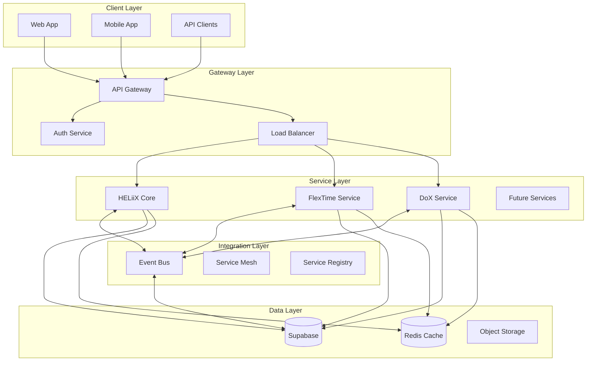
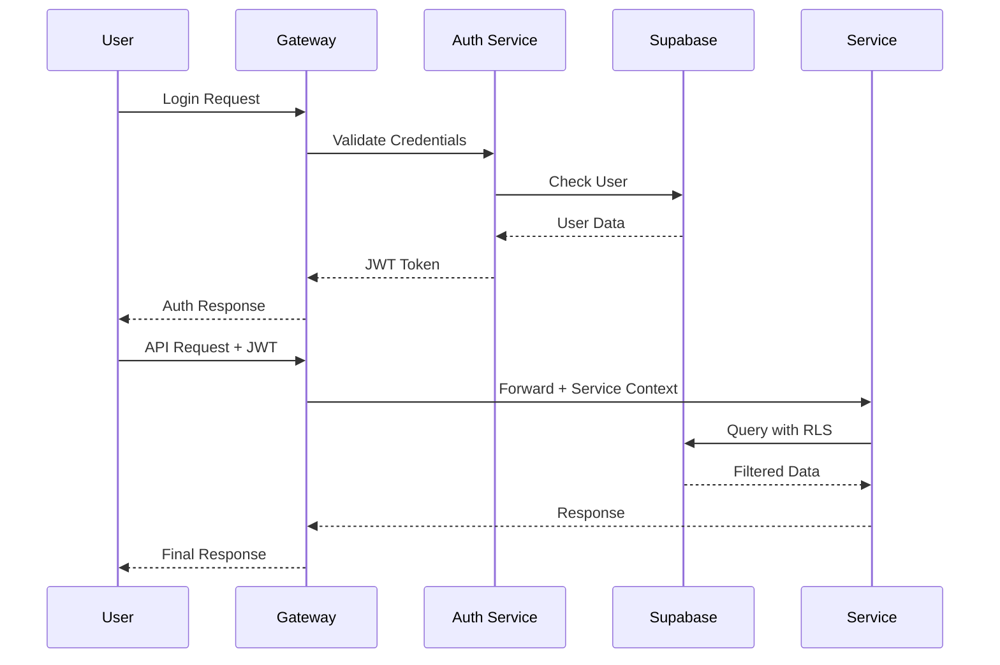

# HELiiX Integration Architecture

_A Scalable, Event-Driven Microservices Platform Built on Supabase_

## Table of Contents

1. [Overview](#overview)
2. [Architecture Principles](#architecture-principles)
3. [System Architecture](#system-architecture)
4. [Data Architecture](#data-architecture)
5. [Service Architecture](#service-architecture)
6. [Integration Patterns](#integration-patterns)
7. [Security Architecture](#security-architecture)
8. [Deployment Architecture](#deployment-architecture)
9. [Monitoring & Operations](#monitoring--operations)
10. [Future Extensibility](#future-extensibility)

## Overview

HELiiX is designed as a distributed microservices platform that orchestrates multiple specialized AI-powered services for the Big 12 Conference and beyond. The architecture leverages Supabase as a central data backbone while maintaining service independence and scalability.

### Key Components

- **HELiiX Core**: Central orchestration platform and user interface
- **FlexTime**: AI-powered sports scheduling service
- **DoX**: Document management and policy generation service
- **Future Services**: Awards tracking, financial management, analytics, etc.

### Architecture Goals

1. **Scalability**: Handle growth from 16 to 100+ organizations
2. **Flexibility**: Easy addition of new services and features
3. **Reliability**: 99.9% uptime with fault tolerance
4. **Performance**: Sub-second response times
5. **Security**: Enterprise-grade security and compliance

## Architecture Principles

### 1. Service Independence

Each service operates independently with its own:

- Repository and deployment pipeline
- Technology stack optimization
- Scaling characteristics
- Development team

### 2. Data Centralization

Supabase provides:

- Single source of truth
- Consistent data models
- Real-time synchronization
- Built-in authentication

### 3. Event-Driven Communication

Services communicate through:

- Asynchronous events
- Message queues
- Real-time subscriptions
- Webhook notifications

### 4. API-First Design

All services expose:

- RESTful APIs
- GraphQL endpoints (where applicable)
- WebSocket connections
- Standardized documentation

## System Architecture



## Data Architecture

### Supabase Schema Strategy

#### 1. Shared Schema (`public`)

Common tables used across all services:

```sql
-- Organizations (Multi-tenant)
CREATE TABLE organizations (
    id UUID PRIMARY KEY DEFAULT uuid_generate_v4(),
    name TEXT NOT NULL,
    type TEXT NOT NULL, -- 'conference', 'institution', 'enterprise'
    metadata JSONB,
    created_at TIMESTAMPTZ DEFAULT NOW()
);

-- Users (Unified authentication)
CREATE TABLE users (
    id UUID PRIMARY KEY REFERENCES auth.users(id),
    organization_id UUID REFERENCES organizations(id),
    email TEXT UNIQUE NOT NULL,
    full_name TEXT,
    role TEXT NOT NULL, -- 'admin', 'user', 'viewer'
    app_metadata JSONB, -- Service-specific permissions
    created_at TIMESTAMPTZ DEFAULT NOW()
);

-- Service Registry
CREATE TABLE services (
    id UUID PRIMARY KEY DEFAULT uuid_generate_v4(),
    service_id TEXT UNIQUE NOT NULL,
    name TEXT NOT NULL,
    version TEXT NOT NULL,
    endpoint TEXT NOT NULL,
    health_endpoint TEXT,
    status TEXT DEFAULT 'active',
    capabilities JSONB,
    created_at TIMESTAMPTZ DEFAULT NOW(),
    updated_at TIMESTAMPTZ DEFAULT NOW()
);

-- Event Store (Event Sourcing)
CREATE TABLE events (
    id UUID PRIMARY KEY DEFAULT uuid_generate_v4(),
    event_type TEXT NOT NULL,
    service_id TEXT NOT NULL,
    organization_id UUID REFERENCES organizations(id),
    user_id UUID REFERENCES users(id),
    payload JSONB NOT NULL,
    metadata JSONB,
    created_at TIMESTAMPTZ DEFAULT NOW(),
    processed_at TIMESTAMPTZ,
    INDEX idx_events_type (event_type),
    INDEX idx_events_service (service_id),
    INDEX idx_events_org (organization_id)
);

-- Audit Log
CREATE TABLE audit_log (
    id UUID PRIMARY KEY DEFAULT uuid_generate_v4(),
    service_id TEXT NOT NULL,
    organization_id UUID REFERENCES organizations(id),
    user_id UUID REFERENCES users(id),
    action TEXT NOT NULL,
    resource_type TEXT,
    resource_id TEXT,
    changes JSONB,
    ip_address INET,
    user_agent TEXT,
    created_at TIMESTAMPTZ DEFAULT NOW()
);
```

#### 2. Service-Specific Schemas

**FlexTime Schema (`flextime`)**

```sql
CREATE SCHEMA flextime;

-- Games, schedules, venues, etc.
-- Inherits organization_id for multi-tenancy
```

**DoX Schema (`documents`)**

```sql
CREATE SCHEMA documents;

-- Policies, manuals, versions, etc.
-- Inherits organization_id for multi-tenancy
```

#### 3. Row-Level Security (RLS)

```sql
-- Enable RLS on all tables
ALTER TABLE organizations ENABLE ROW LEVEL SECURITY;
ALTER TABLE users ENABLE ROW LEVEL SECURITY;
ALTER TABLE events ENABLE ROW LEVEL SECURITY;

-- Organization isolation policy
CREATE POLICY "org_isolation" ON organizations
    FOR ALL USING (
        id IN (
            SELECT organization_id
            FROM users
            WHERE id = auth.uid()
        )
    );

-- Service-specific access
CREATE POLICY "service_access" ON events
    FOR ALL USING (
        service_id = current_setting('app.service_id')::TEXT
        AND organization_id IN (
            SELECT organization_id
            FROM users
            WHERE id = auth.uid()
        )
    );
```

## Service Architecture

### Service Template

Each microservice follows this structure:

```typescript
interface ServiceConfig {
  serviceId: string;
  name: string;
  version: string;
  dependencies: {
    supabase: SupabaseConfig;
    redis?: RedisConfig;
    external?: ExternalService[];
  };
  endpoints: {
    rest: RestEndpoint[];
    graphql?: GraphQLEndpoint;
    websocket?: WebSocketEndpoint;
  };
  events: {
    publishes: EventDefinition[];
    subscribes: EventDefinition[];
  };
  monitoring: {
    health: string;
    metrics: string;
    logs: LogConfig;
  };
}
```

### Service Communication Patterns

#### 1. Synchronous Communication (REST)

```typescript
// API Gateway routes requests
GET /api/v1/flextime/schedules
→ API Gateway
→ FlexTime Service
→ Response

// Inter-service calls via Gateway
POST /api/v1/heliix/notifications
{
  "service": "flextime",
  "event": "schedule_conflict",
  "data": {...}
}
```

#### 2. Asynchronous Communication (Events)

```typescript
// Publish event
await eventBus.publish({
  type: 'SCHEDULE_UPDATED',
  service: 'flextime',
  organizationId: 'big12-conference',
  payload: {
    gameId: '123',
    changes: {...}
  }
});

// Subscribe to events
eventBus.subscribe('POLICY_UPDATED', async (event) => {
  // Update related data
  await updateScheduleCompliance(event.payload);
});
```

#### 3. Real-time Communication (WebSockets)

```typescript
// Supabase Realtime subscriptions
const subscription = supabase
  .channel('schedule_changes')
  .on(
    'postgres_changes',
    {
      event: '*',
      schema: 'flextime',
      table: 'games',
      filter: `organization_id=eq.${orgId}`,
    },
    (payload) => {
      // Handle real-time updates
    }
  )
  .subscribe();
```

## Integration Patterns

### 1. API Gateway Pattern

```typescript
// Kong/Supabase Edge Functions configuration
{
  "services": [
    {
      "name": "flextime",
      "url": "https://flextime.heliixai.com",
      "routes": [
        {
          "paths": ["/api/v1/flextime"],
          "methods": ["GET", "POST", "PUT", "DELETE"]
        }
      ],
      "plugins": [
        { "name": "rate-limiting", "config": { "minute": 100 } },
        { "name": "jwt", "config": { "secret": "..." } },
        { "name": "cors" }
      ]
    }
  ]
}
```

### 2. Service Registry Pattern

```typescript
class ServiceRegistry {
  async register(service: ServiceConfig) {
    const { data, error } = await supabase.from('services').upsert({
      service_id: service.serviceId,
      name: service.name,
      version: service.version,
      endpoint: service.endpoint,
      capabilities: service.capabilities,
    });
  }

  async discover(capability: string) {
    const { data } = await supabase
      .from('services')
      .select('*')
      .contains('capabilities', { [capability]: true })
      .eq('status', 'active');

    return data;
  }
}
```

### 3. Event Bus Implementation

```typescript
class EventBus {
  private supabase: SupabaseClient;
  private subscribers: Map<string, EventHandler[]>;

  async publish(event: Event) {
    // Store event
    await this.supabase.from('events').insert(event);

    // Notify subscribers via Supabase Realtime
    await this.supabase.channel('events').send({
      type: 'broadcast',
      event: event.type,
      payload: event,
    });
  }

  subscribe(eventType: string, handler: EventHandler) {
    this.supabase
      .channel('events')
      .on('broadcast', { event: eventType }, (payload) => {
        handler(payload);
      })
      .subscribe();
  }
}
```

### 4. Saga Pattern for Distributed Transactions

```typescript
class ScheduleSaga {
  async execute(transaction: ScheduleTransaction) {
    const saga = new Saga();

    saga.addStep({
      action: () => flextime.createGame(transaction.game),
      compensate: () => flextime.deleteGame(transaction.game.id),
    });

    saga.addStep({
      action: () => dox.updatePolicy(transaction.policy),
      compensate: () => dox.revertPolicy(transaction.policy.id),
    });

    saga.addStep({
      action: () => heliix.notifyUsers(transaction.notifications),
      compensate: () => heliix.cancelNotifications(transaction.notifications),
    });

    await saga.run();
  }
}
```

## Security Architecture

### 1. Authentication Flow



### 2. Service-to-Service Authentication

```typescript
// Service authentication middleware
async function authenticateService(req: Request) {
  const serviceToken = req.headers['x-service-token'];

  // Verify service token
  const service = await verifyServiceToken(serviceToken);

  // Set service context for RLS
  await supabase.rpc('set_service_context', {
    service_id: service.id,
    capabilities: service.capabilities,
  });
}
```

### 3. Data Access Control

```sql
-- Service-specific data access
CREATE POLICY "service_data_access" ON flextime.games
    FOR ALL USING (
        -- Check service has scheduling capability
        EXISTS (
            SELECT 1 FROM services
            WHERE service_id = current_setting('app.service_id')::TEXT
            AND capabilities @> '{"scheduling": true}'
        )
        -- And user has access to organization
        AND organization_id IN (
            SELECT organization_id FROM users
            WHERE id = auth.uid()
        )
    );
```

## Deployment Architecture

### 1. Container Strategy

```yaml
# docker-compose.yml for local development
version: '3.8'

services:
  heliix:
    build: ./heliix
    environment:
      - SERVICE_ID=heliix-core
      - SUPABASE_URL=${SUPABASE_URL}
    ports:
      - '3000:3000'

  flextime:
    build: ./flextime
    environment:
      - SERVICE_ID=flextime
      - SUPABASE_URL=${SUPABASE_URL}
    ports:
      - '3001:3000'

  dox:
    build: ./dox
    environment:
      - SERVICE_ID=dox
      - SUPABASE_URL=${SUPABASE_URL}
    ports:
      - '3002:3000'

  gateway:
    image: kong:latest
    volumes:
      - ./gateway/kong.yml:/usr/local/kong/declarative/kong.yml
    ports:
      - '8000:8000'
```

### 2. Kubernetes Production Deployment

```yaml
# Service deployment template
apiVersion: apps/v1
kind: Deployment
metadata:
  name: { { service-name } }
spec:
  replicas: 3
  strategy:
    type: RollingUpdate
  template:
    spec:
      containers:
        - name: { { service-name } }
          image: heliixai/{{ service-name }}:{{ version }}
          env:
            - name: SERVICE_ID
              value: { { service-name } }
            - name: SUPABASE_URL
              valueFrom:
                secretKeyRef:
                  name: supabase-config
                  key: url
          resources:
            requests:
              memory: '256Mi'
              cpu: '250m'
            limits:
              memory: '512Mi'
              cpu: '500m'
---
apiVersion: v1
kind: Service
metadata:
  name: { { service-name } }
spec:
  selector:
    app: { { service-name } }
  ports:
    - port: 80
      targetPort: 3000
---
apiVersion: autoscaling/v2
kind: HorizontalPodAutoscaler
metadata:
  name: { { service-name } }
spec:
  scaleTargetRef:
    apiVersion: apps/v1
    kind: Deployment
    name: { { service-name } }
  minReplicas: 2
  maxReplicas: 10
  metrics:
    - type: Resource
      resource:
        name: cpu
        target:
          type: Utilization
          averageUtilization: 70
```

## Monitoring & Operations

### 1. Health Checks

```typescript
// Standardized health check endpoint
app.get('/health', async (req, res) => {
  const health = {
    service: SERVICE_ID,
    status: 'healthy',
    version: VERSION,
    uptime: process.uptime(),
    checks: {
      database: await checkDatabase(),
      redis: await checkRedis(),
      dependencies: await checkDependencies(),
    },
  };

  const isHealthy = Object.values(health.checks).every(
    (check) => check.status === 'healthy'
  );

  res.status(isHealthy ? 200 : 503).json(health);
});
```

### 2. Distributed Tracing

```typescript
// OpenTelemetry integration
import { trace } from '@opentelemetry/api';

const tracer = trace.getTracer(SERVICE_ID);

async function processRequest(req: Request) {
  const span = tracer.startSpan('process_request');

  try {
    span.setAttributes({
      'service.id': SERVICE_ID,
      'org.id': req.organizationId,
      'user.id': req.userId,
    });

    // Process request
    const result = await handleRequest(req);

    span.setStatus({ code: SpanStatusCode.OK });
    return result;
  } catch (error) {
    span.recordException(error);
    span.setStatus({ code: SpanStatusCode.ERROR });
    throw error;
  } finally {
    span.end();
  }
}
```

### 3. Metrics Collection

```typescript
// Prometheus metrics
import { Counter, Histogram, Gauge } from 'prom-client';

const requestCounter = new Counter({
  name: 'service_requests_total',
  help: 'Total requests',
  labelNames: ['service', 'method', 'status'],
});

const requestDuration = new Histogram({
  name: 'service_request_duration_seconds',
  help: 'Request duration',
  labelNames: ['service', 'method'],
});

const activeConnections = new Gauge({
  name: 'service_active_connections',
  help: 'Active connections',
  labelNames: ['service'],
});
```

## Future Extensibility

### 1. Plugin Architecture

```typescript
interface ServicePlugin {
  id: string;
  name: string;
  version: string;
  hooks: {
    beforeRequest?: (req: Request) => Promise<Request>;
    afterRequest?: (res: Response) => Promise<Response>;
    onEvent?: (event: Event) => Promise<void>;
  };
  capabilities: string[];
}

class PluginManager {
  async loadPlugin(plugin: ServicePlugin) {
    // Validate plugin
    await this.validatePlugin(plugin);

    // Register capabilities
    await this.registerCapabilities(plugin);

    // Install hooks
    this.installHooks(plugin);
  }
}
```

### 2. Service Discovery for External Integrations

```typescript
// External service adapter
class ExternalServiceAdapter {
  async connect(config: ExternalServiceConfig) {
    // Register external service
    await serviceRegistry.register({
      serviceId: config.id,
      name: config.name,
      endpoint: config.endpoint,
      capabilities: config.capabilities,
      type: 'external',
    });

    // Set up proxy
    await gateway.addRoute({
      path: `/api/v1/external/${config.id}`,
      target: config.endpoint,
      plugins: ['auth', 'rate-limiting'],
    });
  }
}
```

### 3. Multi-Region Support

```sql
-- Regional data partitioning
CREATE TABLE games_us_west PARTITION OF games
    FOR VALUES IN ('us-west-1', 'us-west-2');

CREATE TABLE games_us_east PARTITION OF games
    FOR VALUES IN ('us-east-1', 'us-east-2');

-- Regional read replicas
CREATE PUBLICATION games_pub FOR TABLE games;
CREATE SUBSCRIPTION games_sub
    CONNECTION 'host=us-east.supabase.co ...'
    PUBLICATION games_pub;
```

### 4. AI/ML Service Integration

```typescript
// AI service integration pattern
class AIServiceIntegration {
  async analyze(data: any) {
    // Queue for batch processing
    await eventBus.publish({
      type: 'AI_ANALYSIS_REQUESTED',
      service: 'ai-analytics',
      payload: {
        dataType: 'schedule_optimization',
        data: data,
        callback: 'flextime.optimizationComplete',
      },
    });
  }

  async handleResults(results: AIResults) {
    // Process AI results
    await this.updateOptimizations(results);

    // Notify relevant services
    await eventBus.publish({
      type: 'AI_ANALYSIS_COMPLETED',
      payload: results,
    });
  }
}
```

## Conclusion

This architecture provides HELiiX with:

1. **Scalability**: Each service scales independently based on load
2. **Flexibility**: New services integrate through standard patterns
3. **Reliability**: Fault isolation and graceful degradation
4. **Performance**: Optimized data access and caching strategies
5. **Security**: Defense in depth with multiple security layers
6. **Maintainability**: Clear separation of concerns and standard patterns

The event-driven microservices approach with Supabase as the data backbone ensures that HELiiX can grow from serving the Big 12 Conference to becoming a platform for hundreds of organizations while maintaining performance and reliability.

---

_Last Updated: January 2025_  
_Architecture Version: 1.0_
